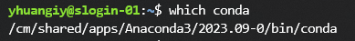
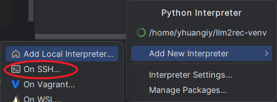
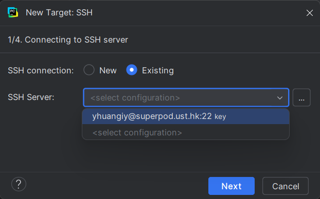
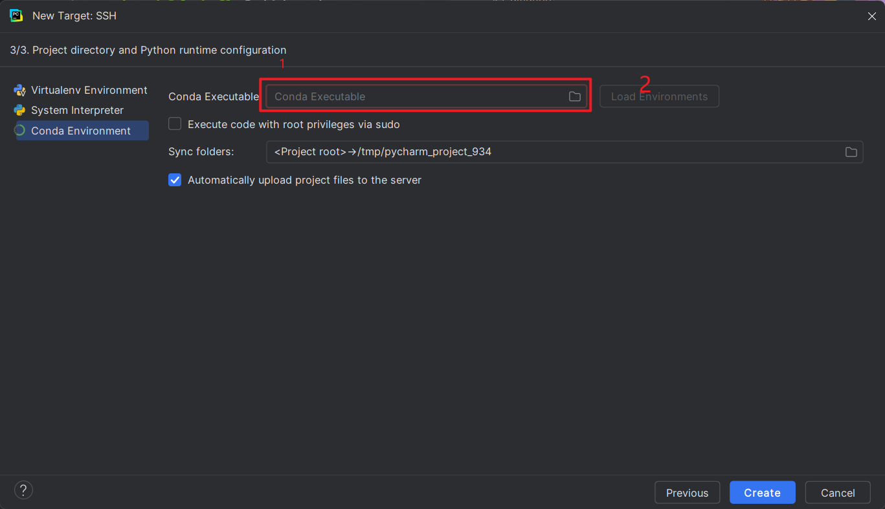

# 组员文档

## 连接服务器

在 Microsoft MFA 基础上再申请一个 Duo，二者缺一不可。在学校外面记得开VPN。

连接学校机器 (无 SSH Key)：

```bash
ssh 你的邮箱名称@superpod.ust.hk
```

登入你的密码，然后用 Duo 验证，进入服务器主界面。这里建议配置SSH远程登陆，会方便很多。

## 申请GPU 资源

申请一个时段的GPU资源：

```bash
srun --account=mscitsuperpod --partition=normal \ 
      --gpus-per-node=1 --time=00:30:00 --pty bash
```

只有 `normal` 分区是可用的。`--time` 一次最高8小时。

只有在申请了资源之后，你的用户层软件才能检测到cuda驱动。
你会发现你的登录名称从 `邮箱名称@slogtin-xx` 变成了 `邮箱名称@dgx-xx`。这就是把你从登录节点迁移到计算节点了。

## 配置远程解释器

### 配置登录项

学校的Linux系统使用`bash` shell，这点可以 `echo $0` 查看。本地PyCharm解释器可以链接到学校Linux电脑内的虚拟环境。在这之前，每次靠ssh链接到服务器的时候都需要执行`module load Anaconda3;`指令。我们将这个指令写进登陆项。

首先，打开`.bashrc`文件。

```bash
nano ~/.bashrc
```

把一下内容贴在文件最顶部：

```bash
if [ -z "$MODULEPATH" ]; then
    source /etc/profile.d/modules.sh
fi
module load Anaconda3
```

这样，每次PyCharm靠SSH连接到服务器时，`Anaconda3`模块会自动加载。否则，PyCharm无法读取服务器的虚拟环境列表。

### 连接服务器端conda

服务器内，打`which conda`，出来一下内容：



新建一个远程SSH解释器.



这里选择你已经登录过的服务器



把你刚刚 `which conda` 出来的东西拷贝进去，然后点 `Load Environments`，这样你服务器里的虚拟环境就能被PyCharm识别到了。




