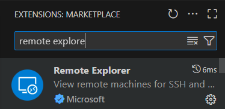

# 组员文档

## 连接服务器

在 Microsoft MFA 基础上再申请一个 Duo，二者缺一不可。在学校外面记得开VPN。

连接学校机器 (无 SSH Key)：

```bash
ssh 你的邮箱名称@superpod.ust.hk
```

登入你的密码，然后用 Duo 验证，进入服务器主界面。

### SSHs

[配置SSH教程](https://hkust-hpc-docs.readthedocs.io/latest/kb/ssh/ssh-login-to-hpc-cluster-without-usi-ImiEj9.html#login-to-hpc-cluster-without-using-password)

### VSCode

搜索 Remote Explorer 插件。安装之后正常配置登录域名及用户即可。



你的操作系统在生成SSH Key的时候会存在本地用户的`.ssh`文件夹里，直接用就行。到时候你直接输入passphrase就能进入系统。有了VSCode，你就可以用图形界面的方式查看服务器内的文件列表，后续还可以用服务器内的Python解释器来作linter，会方便很多。

## 申请GPU 资源

申请一个时段的GPU资源：

```bash
srun --account=mscitsuperpod --partition=normal --gpus-per-node=1 --time=00:30:00 --pty bash
```

只有 `normal` 分区是可用的。`--time` 一次最高8小时。

只有在申请了资源之后，你的用户层软件才能检测到cuda驱动。你会发现你的登录名称从 `邮箱名称@slogtin-xx` 变成了 `邮箱名称@dgx-xx`。这就是把你从登录节点迁移到计算节点了。

## 配置登录项

学校的Linux系统使用`bash` shell，这点可以 `echo $0` 查看。本地PyCharm解释器可以链接到学校Linux电脑内的虚拟环境。在这之前，每次靠ssh链接到服务器的时候都需要执行`module load Anaconda3;`指令。我们将这个指令写进登陆项。

首先，打开`.bashrc`文件。

```bash
nano ~/.bashrc
```

把一下内容贴在文件最顶部：

```bash
if [ -z "$MODULEPATH" ]; then
    source /etc/profile.d/modules.sh
fi
module load Anaconda3
```

这样，每次SSH连接到服务器时，`Anaconda3`模块会自动加载，`conda`命令的指向才会正确。

## 配置虚拟环境

登录学校服务器，确保你在你个人的文件夹下：`/home/你的用户名`。

```bash
conda create --prefix /home/$USER/llm2rec-venv python=3.12 -y
```

跑完如下指令之后，安装PyTorch

```bash
/home/$USER/llm2rec-venv/bin/pip install torch torchvision --index-url https://download.pytorch.org/whl/cu126
```

然后，下载一般的包

```bash
/home/$USER/llm2rec-venv/bin/pip install transformers==4.44.2 llm2vec==0.2.3 wandb fire ninja
```

最后，大头是下载`flash-attn`。这个包需要wheel开着GPU事务编译，所以你需要先申请GPU时段，我建议直接开五个小时，因为这玩意编译完差不多就要三到四个小时。

```bash
MAX_JOBS=16 /home/$USER/llm2rec-venv/bin/pip install flash-attn==2.7.4post1
```

## 下载代码，配置token

### 下载代码

请在本地配置好你的github登录方式：

```bash
git config --global user.name "xxx"
git config --global user.email "xxx"
```

在此之后，直接`git clone`本仓库即可。

在GitHub网站上申请Personal Access Token (https://github.com/settings/tokens)，期限可以直接永久。然后，用**命令行**（不要用VSCode）链接服务器。

执行：

```bash
git config --global credential.helper store
```

然后，对源代码执行一次`git push`（不必专门为此作任何改动）。第一次push会要求你输入用户名和密码。密码就是你的Personal Access Token。上面那条指令会在你输入密码之后记录到本地缓存，你下次push就不用手动输入这个密码了。

### 配置token

需要你们获取两个账号的API Key：

1. Hugging Face，用于登录`huggingface-hub`来下载基座模型。

```bash
huggingface-hub login
```

后续问题一律Yes即可。

2. Wandb，用于记录训练时中间状态，并上传到服务器用于后续分析。这个key会在开始训练的时候问你要，你给就行了。